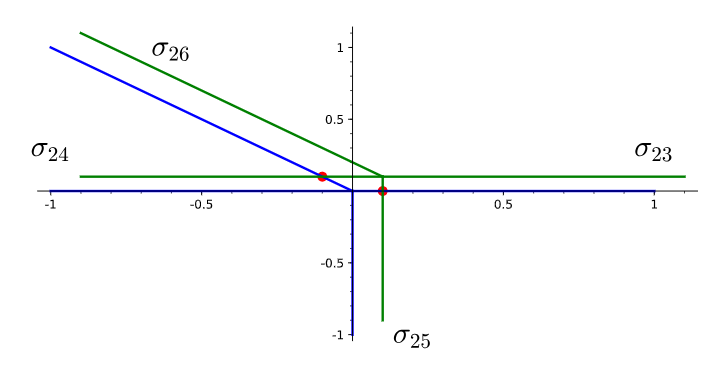

# Minkowski Weights
## Short summary
This is a [SageMath](http://www.sagemath.org) class to compute products of [Minkowski weights](https://arxiv.org/abs/alg-geom/9403002). See the [pull request](https://trac.sagemath.org/ticket/28262) for the current status and more details. I wrote this as part of my [PhD thesis](http://d-scholarship.pitt.edu/37392/).

## Longer version:
[SageMath](http://www.sagemath.org) is Python-based open source math software with support for many kinds of mathematical objects and operations. To understand what my code does, we need a few definitions. This class computes products of Minkowski weights, which are functions defined on fans. Fans are built from cones.

### Cones
Mathematically, cones are a little more general the the shape most people learn about as children. I like to think of them in terms of rays. A ray is a one-dimensional cone, and it can exist in ambient space of any dimension you can imagine. A ray starts at a point (we usually take this to be the origin), and go in a fixed direction. Higher dimensional cones can be constructed from rays by lining up the points, then taking the convex hull. This amounts to shading in all the points between the rays.

### Fans
A fan is a collection of cones where any face of a cone in the fan is also in the fan. Any non-empty intersection of cones in the fan is a face of both cones, and is also in the fan. A simple example is a collection of rays from the origin in 2D space together with the origin itself. Of course fans will contain cones of various dimensions.

### Minkowski weights
A Minkowski weight is a function on cones of a fixed dimension within a fan. A weight assigns an integer to each cone of that fixed dimension subject to a balancing condition. In 2-dimensions, the balancing condition just requires that the weighted sum of ray generators (usually just the first point on the ray where all coordinates are integers) is zero. For higher dimensional cones or fans, there is a balancing condition for each cone in the fan one dimension smaller.

Given a fan, my code: 
* determines a basis for the vector space of weights on cones of a given dimension with the fan
* computes the rank of each vector space of weights

### Products of weights
By [mathematics](https://arxiv.org/abs/alg-geom/9403002), it has beens shown that there is a product structure on the set of Minkowski weights on a fan. Given two balanced weights, it turns out by more mathematics that there is a way to take the product of these functions, and it becomes a weight on cones of a different dimension. This product structure is graded by codimension, which means if the highest dimension cone in the fan is *n*, then the product of a weight on cones of dimension *(n-k)* and a weight on cones of dimension *(n-l)* is a weight on cones of dimension *(n-k-l)*. Rather than dimension *(n-k)* we call this codimension *k*.

My code:
* can compute the product of two weights

### Mechanics of the product of weights

To compute the product of two weights, consider the image below. 

### Mechanics of balancing conditions

